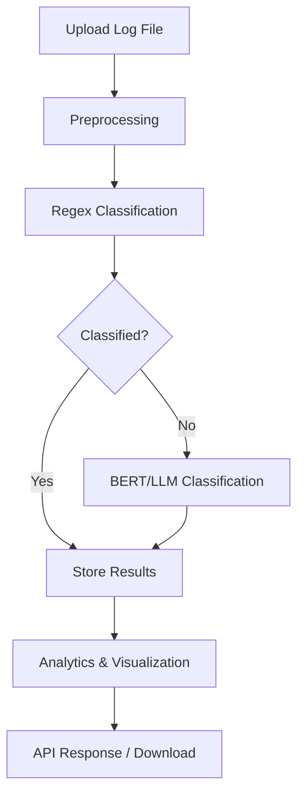

# Log Classification System

A robust log classification system that processes log messages from various source systems, classifies them using regular expressions, BERT embeddings, and LLMs, and provides analytics and visualization via a FastAPI server.

---

## Table of Contents

- [Overview](#overview)
- [Project Structure](#project-structure)
- [Workflow Diagram](#workflow-diagram)
- [Features](#features)
- [Installation](#installation)
- [Usage](#usage)
- [API Endpoints](#api-endpoints)
- [Data](#data)
- [Requirements](#requirements)
- [License](#license)
- [Contact](#contact)

---

## Overview

This system enables automated classification of log data, supporting multi-stage classification and analytics. It is designed for extensibility and ease of integration into enterprise environments.

---

## Project Structure

```
.env
.gitignore
classify.py
processor_bert.py
processor_llm.py
processor_regex.py
requirements.txt
server.py
Model_training/
    log_classification.ipynb
    dataset/
        synthetic_logs.csv
models/
    log_classifier.joblib
resources/
    bar_plot.png
    output.csv
    test.csv
```

---

## Workflow Diagram



---

## Features

- **Multi-Stage Log Classification:** Regex, BERT, and LLM-based classification.
- **Model Training:** Jupyter notebook for training and evaluation.
- **API Server:** FastAPI for file upload, classification, and visualization.
- **Visualization:** Bar plots of log counts per source system.

---

## Installation

### 1. Clone the Repository

```sh
git clone <your-repo-url>
cd Log_classification_system
```

### 2. Set Up a Virtual Environment (Recommended)

```sh
python -m venv venv
venv\Scripts\activate
```

### 3. Install Dependencies

```sh
pip install --upgrade pip
pip install -r requirements.txt
```

---

## Usage

### 1. Train the Model (Optional)

- Open `Model_training/log_classification.ipynb` in Jupyter Notebook.
- Follow the steps to preprocess data, train, and export the model to `models/log_classifier.joblib`.

### 2. Run the API Server

```sh
uvicorn server:app --reload
```

---

## API Endpoints

- `POST /classify/`  
  Upload and classify a log file.

- `GET /plot/`  
  Retrieve a bar plot of log counts per source.

---

## Data

- **Input:** `Model_training/dataset/synthetic_logs.csv`
- **Output:** `resources/output.csv`, `resources/bar_plot.png`

---

## Requirements

- Python 3.12+
- See [requirements.txt](requirements.txt) for the full list.

---

## License

This project is for educational and research purposes.

---

## Contact

**Author:** Sarvagya Gupta
